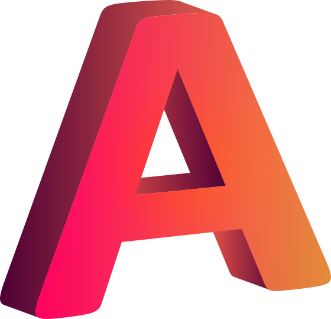

<div align="center"> 
   <h1>👋 Welcome to My Portfolio Website</h1>
    </div>

<div align="center">
  
   &nbsp;&nbsp;&nbsp;&nbsp;
  <h4>
    My Portfolio Website a reflection of my journey as a frontend developer, showcasing my skills, projects, and creativity with interactive, responsive design.
  </h4>
  <p>
    <span style="font-size: 1.2em; font-weight: bold;">🔗 Live Demo:</span>
    <a href="https://ahad-portfolio-pi.vercel.app/" target="_blank">
      Ahad Portfolio Website
    </a>
  </p>
</div>

<br clear="both">

<hr/>

### 🎯 **About This Project**
A professional portfolio and personal branding site that brings my developer journey to life with interactive 3D elements and smooth animations. It features clean UI/UX and highlights my work and skills through modern web tech.

### 🔥 **Key Highlights**
✅ **3D Interactivity** – Built with **React Three Fiber & Three.js** for immersive 3D experiences.  
✅ **Performance Optimized** – Fast load times with optimized assets and lazy loading.  
✅ **Fully Responsive** – Works across desktops, tablets, and mobile devices.  
✅ **Modern UI/UX** – Styled with **Tailwind CSS** for a clean and professional look.  
✅ **Easy Navigation** – Smooth scrolling and intuitive layout for better user experience.  
✅ **Hosted on Vercel** – Easily accessible with continuous deployment.

---

### 🛠️ **Tech Stack & Tools**

**Frontend:**<br/><br/>


<br/><br/>**3D Graphics:**<br/><br/>


<br/><br/>**Styling:**<br/><br/>


<br/><br/>**Build Tool:**<br/><br/>

<br/><br/>**Code quality and Formatting:**<br/><br/>


<br/><br/>**Version Control:**<br/><br/>


<br/><br/>**Hosting:**<br/><br/>


---

### 🚀 Getting Started
To run this project locally, follow these steps:

### Prerequisites
- [Node.js](https://nodejs.org/) installed
- Git installed

### Installation
1. **Clone the repository**
   ```sh
   git clone https://github.com/Ahad-Awan/portfolio-ahad.git
   cd portfolio-ahad
   ```
2. **Install dependencies**
   ```sh
   npm install
   ```
3. **Run the development server**
   ```sh
   npm run dev
   ```
---

### 📜 License
This project is licensed under the MIT License. See the [LICENSE](LICENSE) file for details.

<br/><br/>

<div align="center"> 
   <h3>📩 Connect with Me ⬇️</h3>
   <h4>I’m actively looking for new opportunities! If you're a recruiter or hiring manager, feel free to reach out.</h4>
   <a href="https://www.linkedin.com/in/muhammad-ahad1/" target="_blank">
     
   </a>
   <a href="https://github.com/Ahad-Awan" target="_blank">
     
   </a>
</div>
